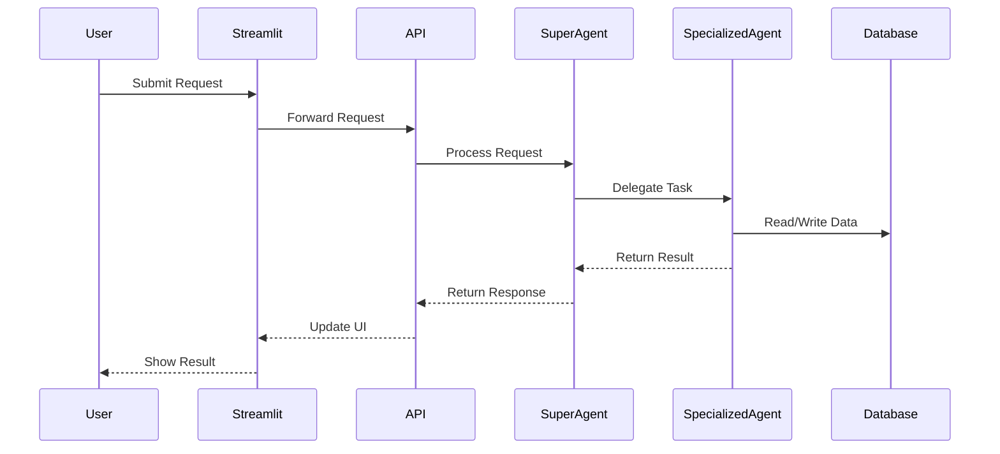
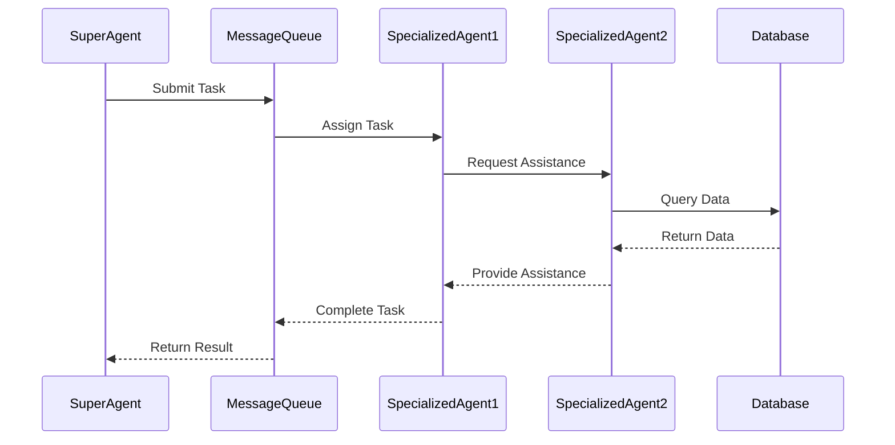

# WrenchAI System Architecture

## Overview

WrenchAI is a distributed AI-powered development assistant system built on a microservices architecture. The system comprises multiple specialized agents that work together to assist in software development tasks, from code analysis to documentation generation.

## Core Components

### 1. Agent System

#### Agent Framework
- **Base Agent Structure**: Common functionality for all agents
  - Message handling
  - Task processing
  - State management
  - Error recovery
  - Tool registry integration

#### Specialized Agents
- **SuperAgent**: Orchestration and task delegation
- **InspectorAgent**: Code analysis and quality assurance
- **JourneyAgent**: User interaction and task management
- **DBAAgent**: Database operations and optimization
- **TestEngineerAgent**: Test suite design and execution

### 2. Communication Layer

#### Message Queue System
- Asynchronous message passing between agents
- Priority-based message routing
- Message persistence
- Delivery guarantees
- Error handling and recovery

#### WebSocket Integration
- Real-time updates to frontend
- Bi-directional communication
- Connection management
- Session handling

### 3. Storage Layer

#### Database Architecture
```
├── Primary Database (PostgreSQL)
│   ├── User Management
│   ├── Task Management
│   ├── Agent State
│   └── System Configuration
└── Cache Layer (Redis)
    ├── Session Data
    ├── Real-time Updates
    └── Rate Limiting
```

#### Data Models
- Fully normalized schema
- Optimized indexes
- Audit trails
- Version control

### 4. API Layer

#### FastAPI Implementation
- RESTful endpoints
- WebSocket support
- OpenAPI documentation
- Authentication/Authorization
- Rate limiting
- Request validation

### 5. Frontend Layer

#### Streamlit Interface
- Real-time updates
- Interactive components
- Responsive design
- Session management
- Error handling

## System Interactions

### 1. Request Flow


### 2. Agent Communication


## Security Architecture

### 1. Authentication
- OAuth2 with JWT
- Role-based access control
- Session management
- API key management

### 2. Data Protection
- Encryption at rest
- TLS for data in transit
- Secure credential storage
- Input validation

### 3. Rate Limiting
- Per-user limits
- Global limits
- Burst handling
- Custom rules

## Monitoring and Observability

### 1. Metrics Collection
- System metrics
- Application metrics
- Business metrics
- Custom metrics

### 2. Logging
- Structured logging
- Log aggregation
- Error tracking
- Audit trails

### 3. Alerting
- Threshold-based alerts
- Anomaly detection
- Incident management
- Escalation paths

## Deployment Architecture

### 1. Container Architecture
```
├── Application Containers
│   ├── API Service
│   ├── Agent Services
│   ├── WebSocket Service
│   └── Frontend Service
├── Infrastructure Containers
│   ├── Database
│   ├── Cache
│   ├── Message Queue
│   └── Monitoring
└── Support Services
    ├── Load Balancer
    ├── Service Discovery
    └── Configuration Management
```

### 2. Scaling Strategy
- Horizontal scaling for stateless services
- Vertical scaling for databases
- Auto-scaling based on metrics
- Load balancing

## Development Workflow

### 1. Code Organization
```
wrenchai/
├── core/
│   ├── agents/
│   ├── tools/
│   └── db/
├── fastapi/
│   ├── app/
│   └── tests/
├── streamlit_app/
├── docs/
└── tests/
```

### 2. Testing Strategy
- Unit tests
- Integration tests
- End-to-end tests
- Performance tests

## Future Considerations

### 1. Scalability
- Distributed agent deployment
- Cross-region support
- Enhanced caching
- Performance optimization

### 2. Extensibility
- Plugin system
- Custom agent development
- Tool integration
- API versioning

### 3. AI/ML Improvements
- Model fine-tuning
- Custom model deployment
- Enhanced reasoning
- Specialized capabilities 